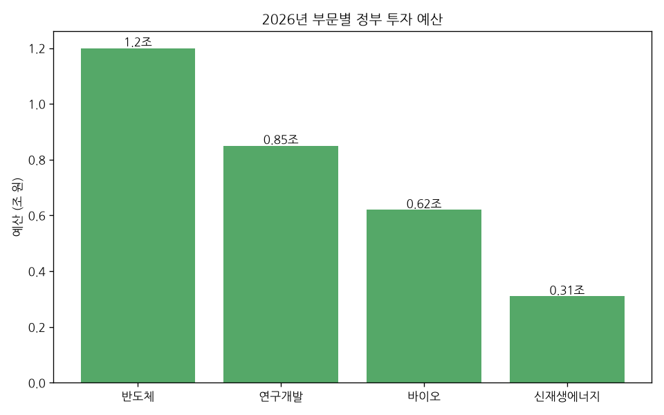
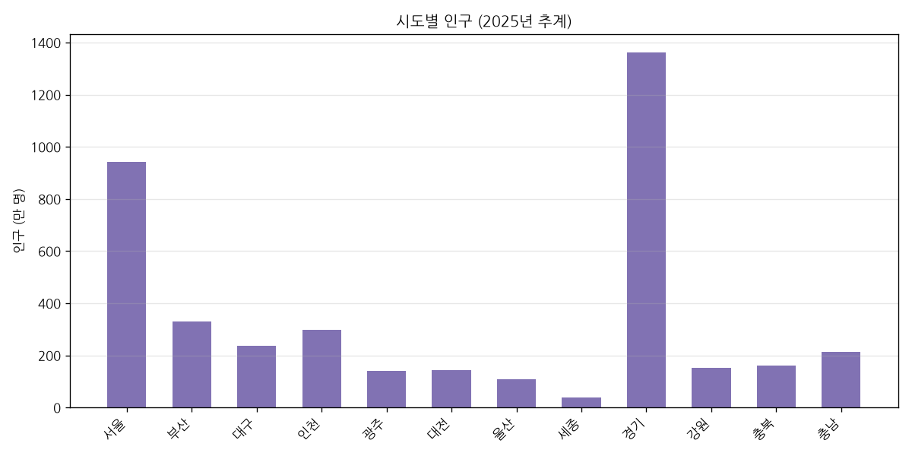
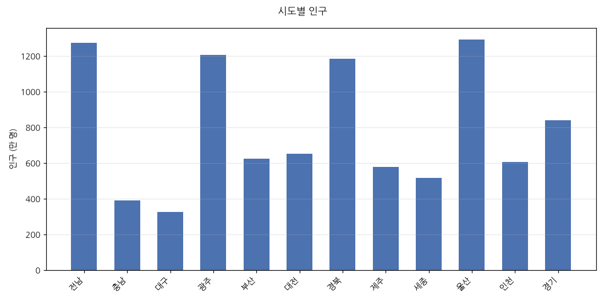
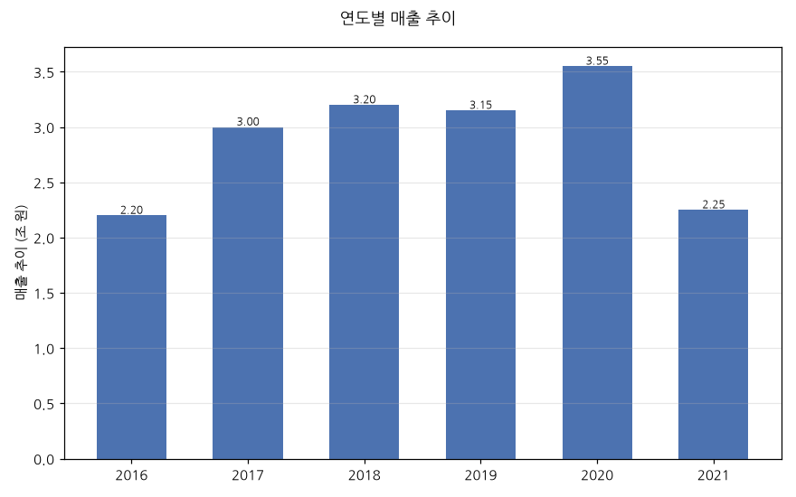
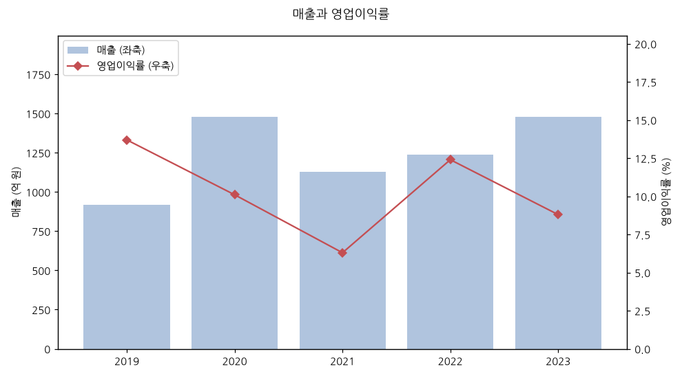
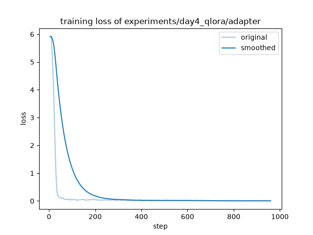

# 한국어 차트를 못 읽는 VLM, 7일 만에 고치기

### — 진단부터 파인튜닝, 서빙까지 풀사이클로

> 오픈소스 VLM(Qwen3-VL-8B)이 한국어 차트를 얼마나 읽는지 **숫자로 측정**하고,
> 합성 데이터로 **QLoRA 파인튜닝**해 **val 70.2% → 96.6%**로 끌어올린 뒤,
> **vLLM으로 서빙**까지 한 7일 사이드 프로젝트 기록입니다.
> 코드·실험 전체는 [ko-chart-vlm 저장소](../README.md)에 있습니다.

---

## 한눈에 보기

| | zero-shot | 파인튜닝 후 |
|---|---|---|
| **전체 정확도** (val 564문항) | 70.2% | **96.6%** _(+26.4%p)_ |
| 조→억 단위 환산 | **0%** | **96%** |
| 조밀 차트 순위 | 57% | 95% |
| 근소 값 비교 | 79% | 96% |

- **다룬 역량**: ① 도메인 파인튜닝(QLoRA) ② 합성 데이터 구축 ③ 평가 벤치마크 설계 ④ vLLM 서빙·AWQ 경량화
- **모델**: Qwen/Qwen3-VL-8B-Instruct · **GPU**: RTX 4090 한 장 · **학습**: 약 1시간 40분
- **원칙**: *모든 주장은 수치로, 실패도 그대로 기록*

---

## 왜 만들었나

국내 VLM 채용 공고를 훑어보면 요구 역량이 겹칩니다. **파인튜닝(SFT/LoRA), 데이터 구축,
평가 벤치마크 설계, vLLM 서빙·경량화.** "할 줄 안다"는 말 대신, 이 네 가지를 **하나의 문제에서
처음부터 끝까지** 돌려 본 증거를 만들고 싶었습니다.

소재는 **한국어 차트 이해**로 정했습니다. 리포트·대시보드처럼 실무에서 흔하고, 영어권 데이터로
학습된 모델이 유독 약한 지점이 있어 "고쳤다"를 보여주기 좋기 때문입니다.

---

## Day 1 — 뭘 못하는지부터 본다

데이터를 겨냥하려면 먼저 모델이 **어디서 무너지는지** 알아야 합니다. 한국어 차트 8장에 질문 16개를
손으로 만들어 물었습니다. 결과는 **strict 75%**. 기본기(값 읽기·최댓값·범례)는 이미 튼튼했지만,
세 군데서 반복적으로 틀렸습니다.

**약점 ① 한국어 단위 환산**

*"연구개발 예산을 억 원으로?"라고 묻자…*

> **질문**: 연구개발 부문 예산은 몇 억 원인가요? (차트엔 `0.85조`)
> **모델**: 850억 원 ❌  ·  **정답**: 8,500억 원

정확히 **10배 오류**입니다. `1조 = 10,000억`이라는 한국어 단위 체계가 통째로 비어 있었습니다.

**약점 ② 값 라벨 없는 차트의 순위**

*값 숫자 없이 축 눈금만으로 읽어야 하는 조밀한 막대.*

> **질문**: 인구가 3번째로 많은 시도는? (경기 > 서울 > **부산**)
> **모델**: 대구 ❌

**약점 ③ 근소한 차이 비교** — 36 vs 35처럼 거의 같은 높이의 대소 판단 실패.

이 3종이 이후 6일의 **공격 목표**가 됐습니다.

---

## Day 2 — 약점을 겨냥한 합성 데이터

데이터는 "많이"가 아니라 "약점에 맞게" 만들면 됩니다. matplotlib + 나눔고딕으로 차트 2,000장을 렌더해
**5,671 QA쌍**을 생성했습니다.

| | | |
|---|---|---|
|  |  |  |
| *무라벨 → 순위·판독 강제* | *조 단위 → 환산 연습* | *이중축 함정* |

설계에서 신경 쓴 것들:

- **조→억 환산만** 다뤘습니다. 조 값을 축 스텝에 맞춰 반올림하면 `×10,000`이 항상 깔끔한 정수라
  **strict(±1%) 채점**이 안전합니다.
- **차트 절반 이상을 값 라벨 없이** 렌더했습니다. 라벨 있는 차트는 모델이 이미 잘하니 학습 신호가 약합니다.
- **정답은 원본 데이터에서 계산**했고 하드코딩이 없습니다. 값이 동률이라 정답이 유일하지 않은 문항은 자동 배제.
- train/val을 **다른 시드**로 분리해 데이터 누수를 막았습니다.

---

## Day 3 — 점수를 매기는 잣대부터 믿는다

파인튜닝 전에, 채점기가 신뢰할 수 있어야 합니다. 문항마다 채점 유형을 부여했습니다. 카테고리는
정규화 후 부분일치, 수치는 상대오차 — 단 **단위 환산은 자릿수 오류가 본질**이라 `±1% strict`로 따로 봤습니다.

핵심은 한국어 단위를 **정규 원-환산값**으로 바꿔, 모델이 어떤 단위로 답하든 같은 잣대로 비교하는 것입니다.
`"8,500억"`, `"0.85조"`, `"850000000000"`을 전부 동일하게 채점합니다. (채점기 자체검증 20/20 통과.)

zero-shot 베이스라인은 **val 564문항 70.2%**. 그리고 예상대로 **unit_convert 0/73** — 73문항 중
조→억 환산을 시도한 답이 **하나도** 없었습니다.

> 흥미로운 정밀화: 무라벨이라도 **값 하나 읽기는 91%**로 튼튼했습니다.
> 진짜 약점은 '읽기'가 아니라 **여러 항목의 순위 매기기**(조밀 차트 41%)였습니다.

---

## Day 4 — QLoRA로 도메인 적응

LLaMA-Factory로 Qwen3-VL-8B를 **QLoRA(4bit)** 파인튜닝했습니다. ViT와 멀티모달 프로젝터는 얼리고
**LLM 디코더만** 학습 — 학습 파라미터는 전체의 **0.5%(43.6M)**뿐입니다. RTX 4090 한 장, 3 epoch, 약 1시간 40분.

*손실이 step ~65(epoch 0.2)에서 5.9 → 0.04로 급락 후 평탄. 좁고 정형화된 태스크라 순식간에 학습된다.*

이 급격한 수렴이 나중에 "1 epoch면 충분한가?"라는 ablation으로 이어집니다.

> **실전 팁 두 가지**
> - RTX 4090은 P2P 미지원이라 `NCCL_P2P_DISABLE=1 NCCL_IB_DISABLE=1`이 필수입니다.
> - 학습은 **별도 venv에 격리**해, 추론·평가용 메인 환경(버전 고정)을 오염시키지 않았습니다.

---

## Day 5 — 정말 좋아졌나? 오류 분석과 ablation

정식 평가 결과입니다.

| 유형 | zero-shot | QLoRA | 개선 |
|---|---|---|---|
| **전체** | 70.2% | **96.6%** | **+26.4%p** |
| 조→억 환산 | 0% | 96% | +96%p |
| 조밀 차트 순위 | 57% | 95% | +38%p |
| 근소 비교 | 79% | 96% | +17%p |

**잔여 오답의 성격이 바뀌었습니다.** Day 3의 오류는 *체계적 능력 공백*(환산 0%, 순위 붕괴)이었지만,
남은 19건은 거의 전부 **거의 같은 값을 구분하는 near-tie 시지각 문제**였습니다. 조→억 잔여 오답 3건조차
환산이 아니라 무라벨 막대를 축 한 칸 잘못 읽은 **판독 오차**입니다.

여기서 이 프로젝트에서 가장 마음에 드는, 정직한 발견 두 가지가 나옵니다.

**① 합성 SFT는 렌더링 분포에 과적합한다.**
Day 1 수기 차트(분포 밖)로 재평가하니 75% → 81%로 *부분만* 전이됐습니다. 특히 그 조→억 문제에서
base는 10배 *과소*(850억), 파인튜닝 모델은 10배 *과대*(85,000억) — **오류의 방향만 뒤집혔습니다.**
환산 산술은 배웠지만, 시각적으로 다른 차트에선 자릿수 판독이 흔들린 것입니다. 합성 데이터의 힘과
한계를 동시에 보여줍니다.

**② 1 epoch면 사실상 충분했다.**
손실이 극초반에 포화한다는 관찰대로, ablation에서 1 epoch가 3 epoch의 **~99%(95.7 vs 96.6%)**를
**1/3 시간**에 달성했습니다.

---

## Day 6 — 서빙, 그리고 현실

파인튜닝 어댑터를 base에 병합해 **vLLM 두 서버**(원본 vs 파인튜닝)로 올리고, 같은 차트·질문을 양쪽에
던져 나란히 비교하는 Gradio 데모를 만들었습니다.

> **조→억 질문 라이브 비교**
> 원본: `850억` ❌  →  파인튜닝: `8,500억` ✅

**AWQ 경량화**도 시도했습니다. W4A16 양자화로 **17GB → 6.8GB(~2.5배)**, 텍스트 추론은 정확합니다
("1조는 몇 억?" → "10,000억"). 다만 멀티모달 서빙은 드라이버 제약으로 고정된 구버전 vLLM에서 막혀
bf16을 폴백으로 뒀습니다.

그리고 서빙에서 가장 값진 교훈이 나왔습니다. **오프라인 정확도가 서빙으로 그대로 이어지지 않는다.**

| 동일 이미지·가중치 | transformers(평가) | vLLM(서빙) |
|---|---|---|
| 파인튜닝 모델 답 (정답 150,000억) | **150,000억** ✅ | 60,000억 ❌ |

같은 모델인데 스택이 다르면 답이 다릅니다. 원인은 **이미지 전처리 경로 불일치** — 평가는
qwen_vl_utils(factor 28), 서빙은 vLLM의 Qwen3-VL 프로세서(factor 32)로 리사이즈 그리드가 달라
조밀 차트 판독이 흔들렸습니다. 벤치 점수만 믿었다면 놓쳤을 **train/serve preprocessing skew**를
서빙 단계에서 실제로 잡아낸 사례입니다.

---

## 7일에서 배운 것

- **진단이 데이터를 만든다.** 무작정 많이가 아니라 측정된 약점에 분포를 맞추면, 0.5% 파라미터로도 크게 바뀝니다.
- **채점 기준을 먼저 믿을 수 있게 만들어라.** 채점기 자체검증과 strict/relaxed 구분이 "환산 0%" 같은 진실을 드러냈습니다.
- **좋아 보이는 숫자를 의심하라.** 합성 val 96%는 진짜지만 OOD·서빙에선 다르게 나옵니다. 두 곳에서 다시 재는 게 정직합니다.
- **경량화·서빙은 버전 정합 싸움이다.** 드라이버(CUDA 12.2) 하나가 vLLM·transformers·양자화 도구 버전 사슬을 전부 제약했습니다.

---

## 재현 & 링크

- **저장소**: [`ko-chart-vlm`](../README.md) — 일자별 리포트·코드·wandb 로그
- **리포트**: [Day 3 baseline](../experiments/day3_baseline/report.md) · [Day 4 QLoRA](../experiments/day4_qlora/report.md) · [Day 5 평가](../experiments/day5_eval/report.md) · [Day 6 서빙](../experiments/day6_serving/report.md)
- **스택**: Qwen3-VL-8B · LLaMA-Factory(QLoRA) · vLLM · llmcompressor(AWQ) · uv

*모든 이미지·QA는 seed로 재생성 가능하며, 정답은 원본 데이터에서 계산했습니다. 실패 사례도 리포트에 그대로 남겨 두었습니다.*
