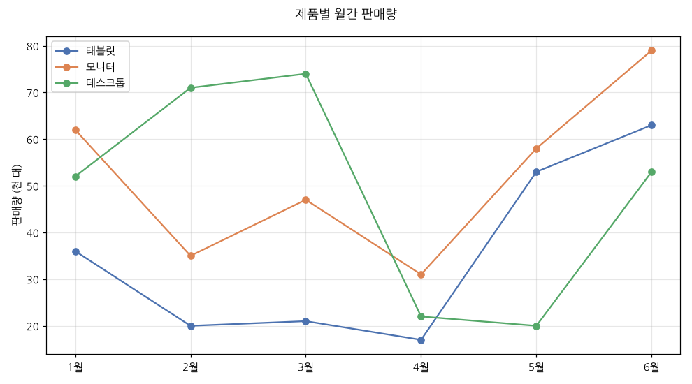
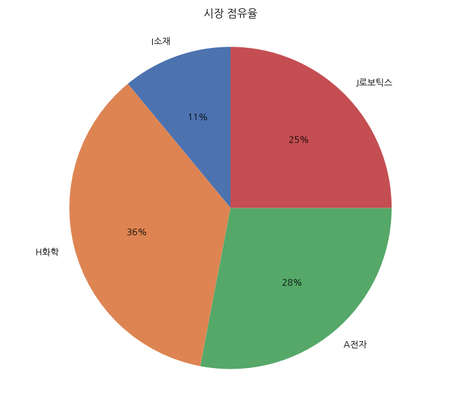
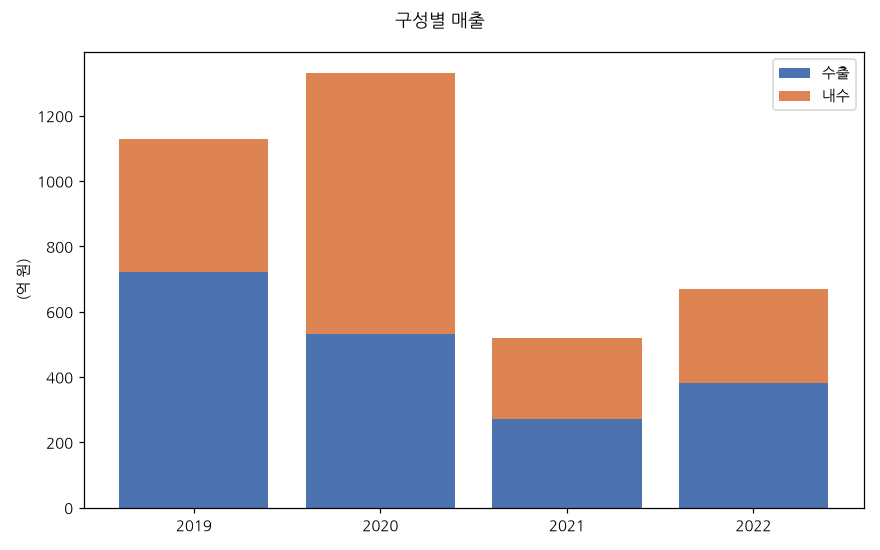

# Day 2 — 한국어 차트 QA 합성 데이터셋 생성

- **날짜**: 2026-07-20 · **생성기**: [scripts/make_chart_dataset.py](../../scripts/make_chart_dataset.py) · **seed**: 20260720
- **규모**: 2,000 차트 → **5,671 QA** (train 5,107 / val 564), 생성 256초
- **목적**: Day 1 zero-shot 진단([day1_zeroshot/report.md](../day1_zeroshot/report.md))에서 드러난 3대 약점을 집중 공략하는 파인튜닝용 데이터 확보

## 설계 원칙 — Day 1 약점 → 데이터 분포

| Day 1 약점 | 데이터 설계 | 달성치 (train) |
|---|---|---|
| ① 한국어 단위 환산 (조↔억, 10배 오류) | `unit_convert` 유형 확대, **조→억만** (1조=10,000억), **strict 채점** | 687개 (13%) |
| ② 값 라벨 없는 차트 판독·순위 | 차트 **절반 이상 라벨 제거**(축만 보고 읽기) + `rank_kth` 유형 | 무라벨 **55.7%**, rank_kth 884개 |
| ③ 근소한 차이 비교 | 값 두 개를 1스텝 차이로 **near-tie 주입** → `narrow_compare` | 1,057개 (21%) |

타깃 약점 유형(unit_convert·rank_kth·narrow_compare·dual_trap)이 전체 QA의 **약 55%**를 차지한다.

## 데이터셋 구성

**질문 유형 분포 (train 5,107)**

| 유형 | 개수 | 채점 | 설명 |
|---|---|---|---|
| narrow_compare | 1,057 | category(정확일치) | 근소차 두 항목 대소 |
| rank_kth | 884 | category | k번째로 큰 항목 |
| argmax | 814 | category | 최댓값 항목 |
| **unit_convert** | **687** | **numeric_strict** | 조→억 환산 |
| cross_series | 626 | category | 특정 지점 최대 시리즈 |
| value_read | 563 | numeric_relaxed(±5%) | 값 읽기 (무라벨은 근사) |
| sum | 234 | numeric_relaxed | 합산 |
| dual_trap | 194 | category | 이중축 함정 (좌/우축 혼동) |
| diff | 48 | numeric_relaxed | 차이 |

**차트 종류**: dense(막대 다범주) 1,361 · bar 1,062 · grouped 601 · stacked 568 · dual 532 · line 519 · pie 464

**채점 유형**: category 3,575 · numeric_relaxed 845 · numeric_strict 687
→ Day 3 평가 하네스는 category=정규화 후 정확일치, numeric_relaxed=±5%, numeric_strict=±1%(자릿수 오류 검출)로 채점한다.

## 샘플

| | |
|---|---|
|  라벨 없는 다범주 막대 — 순위/판독 |  조 단위 막대 — 조→억 환산 |
|  이중축 — 매출 최고연도≠이익률 최고연도 |  다중 시리즈 — 지점별 비교 |
|  점유율 — 합산/순위 |  누적 — 구성 합산 |

## 주요 설계 결정

- **unit_convert는 조→억만**: Day 1 오류가 정확히 이 축이었고, 조 값을 축 스텝(0.05조)에 맞춰 반올림해 `×10,000`이 항상 깔끔한 정수(예: 2.35조→23,500억)라 strict 채점이 안전. 억↔만·역방향 환산은 분수/자릿수 애매성 때문에 제외.
- **무라벨 정책**: pie는 항상 라벨(비율은 라벨 없으면 애매), unit_convert 차트는 50%만 라벨(값이 축에서 읽히므로 무라벨도 공정), 나머지는 65% 무라벨 → 전체 55.7%.
- **GT는 원본 데이터에서 계산**: 하드코딩 정답 없음. 정답이 애매한 경우(값 동률로 argmax/rank/narrow가 유일하지 않을 때)는 해당 QA를 자동 배제.
- **train/val 분리 시드**(seed / seed+999)로 누수 방지. val은 별도 이미지·QA.
- **이미지는 git에서 제외**([.gitignore](../../.gitignore)) — seed로 재생성 가능. QA json·manifest·샘플만 커밋.

## 재현

```bash
uv run scripts/make_chart_dataset.py --charts 2000 --val-frac 0.1
```

분포 통계: [data/synth/manifest.json](../../data/synth/manifest.json)

## 다음 (Day 3)

- 이 val 세트로 **평가 하네스** 작성: category/numeric_relaxed/numeric_strict 자동 채점 → relaxed·strict accuracy 산출
- Day 1 진단 세트(16문항)와 이 val 세트에서 **파인튜닝 전 baseline** 재측정
- 이후 Day 4: LLaMA-Factory QLoRA 파인튜닝 → 개선폭 측정
